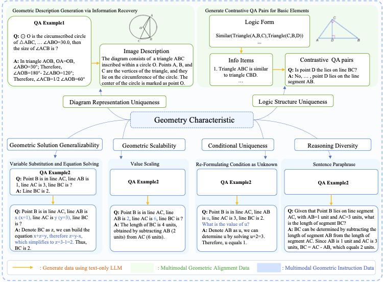

# G-LLaVA: Solving Geometric Problem with Multi-Modal Large Language Model

This repository contains the code and data for the paper titled "G-LLaVA: Solving Geometric Problem with Multi-Modal Large
Language Model".

[Paper](https://arxiv.org/pdf/2312.11370.pdf), [Dataset](coming soon), [Model Parameters](coming soon)




This github repo will be updated soon, stay tuned!

## Acknowledgement
The project is built on top of the great [LLaVA](https://github.com/haotian-liu/LLaVA) repository. Thanks for these great work!


If you find our code and dataset helpful to your research, please consider citing us with this BibTeX:
```bibtex
@misc{gao2023gllava,
      title={G-LLaVA: Solving Geometric Problem with Multi-Modal Large Language Model}, 
      author={Jiahui Gao and Renjie Pi and Jipeng Zhang and Jiacheng Ye and Wanjun Zhong and Yufei Wang and Lanqing Hong and Jianhua Han and Hang Xu and Zhenguo Li and Lingpeng Kong},
      year={2023},
      eprint={2312.11370},
      archivePrefix={arXiv},
      primaryClass={cs.CL}
}
```